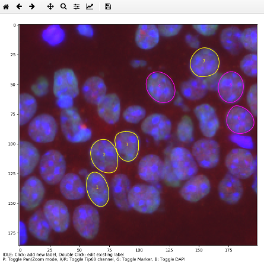

# cell_label_tool



Python tool for manually labeling elliptical cells with the following features:

* each cell is labeled by 3 clicks only, that define an ellipse. If required, the created ellipse can be modified using control points. 
* each label can be assigned to one of two classes
* for each label different image metrics can be computed such as:
  * area in pixels
  * median, mean, min and max of the pixel intensity values for the red, green, and blue channel
* results are written into a CSV file that can be imported into Excel


## Requirements

requires scikit-image

on Ubuntu install with:

```sudo apt install python3-skimage```

or

```pip3 install scikit-image```

## Usage

Start with:

```cell_label_tool.py example/image.png```

### Keys:

| Key          | Mode | Action                                                       |
| ------------ | ---- | ------------------------------------------------------------ |
| Left Click   | IDLE | create new label (2 more clicks required to define an ellipse) |
| Double Click | IDLE | edit an existing label                                       |
| Space        | EDIT | save label                                                   |
| Esc          | EDIT | discard changes                                              |
| Del          | EDIT | delete label                                                 |
| K            | EDIT | toggle class                                                 |
| T            | EDIT | toggle thin border / control points                          |
| P            | IDLE | toggle pan / zoom mode                                       |
| E            | IDLE | evaluate image metrics and export results into a csv file    |
| R,G,B        | *    | toggle red, green, blue channel                              |

